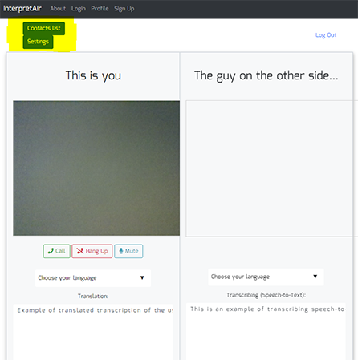
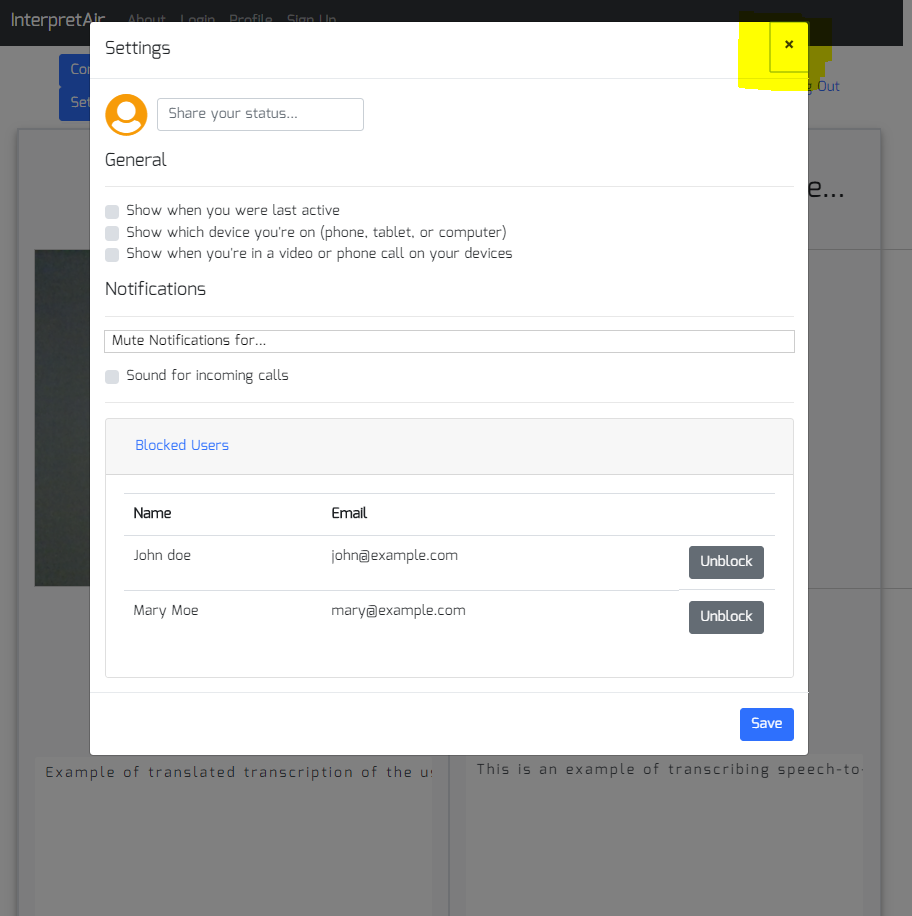
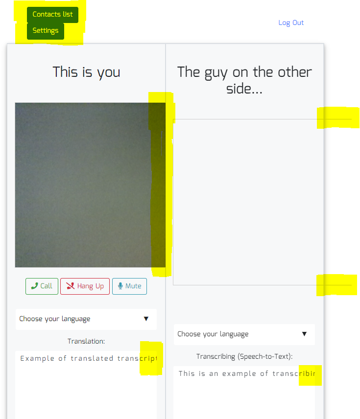
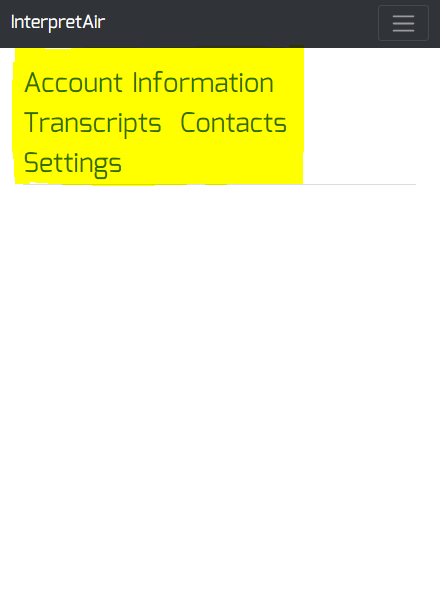
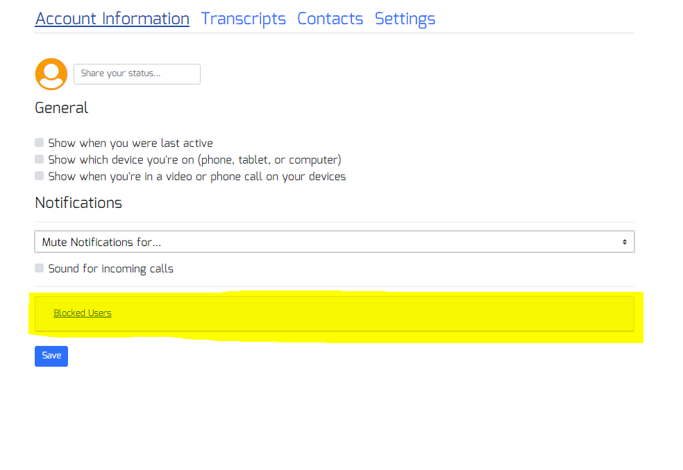
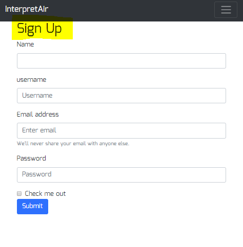
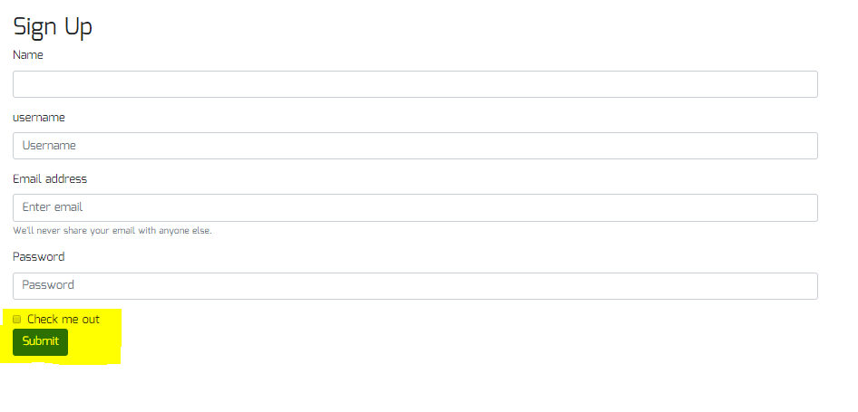
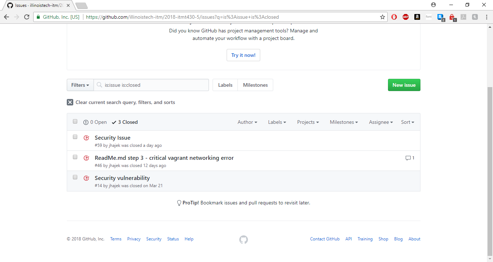

# ITMT 430
# Team 5 Octocat - InterpretAir Project

## Team Members
1.  Alex Wang
2.  Aury-Ken Bwashi
3.  David Powers
4.  Khang Duong

---

# 13 Project Base Requirements

### 1. [MEAN Stack]
We used the MEAN stack.

MEAN is an acronym short for Mongo DB (database system), Express (back-end web framework), Angular.js (front-end framework) and Node.js (back-end runtime environment). Our team is the most comfortable with Javascript and it is a modern approach to web development. JavaScript is a dynamic programming language for client-side and server-side web application development.

MEAN stack uses JSON as the format for data-interchange on all the layers. So, there is no need to use libraries for converting data during client-side and server-side interaction. JSON also allows working with external APIs (application programming interfaces) easily which is ideal for our project.

**MongoDB** will be discussed further in Data Store section.

**Express.js** is used in creating server side web applications faster and smarter, simplicity, minimalism, flexibility, scalability, easy to configure and customize, allows you to create rest API server, easy to connect with databases.

**Angular.js** is a front-end JavaScript development framework for developing single-page applications. It allows a clean way of adding interactive functions and AJAX-driven rich components on the client-side. Since, you have Node.js providing a server-side solution; there is JavaScript implementation on both client and server-side. This makes programming applications with MEAN stack very effective.

**Node.js** (8.10.0) also runs on LINUX, Windows and OS X. Node.js operates on a single thread for processing incoming HTTP requests. It uses non-blocking I/O (input-output) calls to handle multiple new incoming requests efficiently. Unlike other web servers like Apache, Node.js is extremely fast and scalable, supporting thousands of concurrent connections. Node.js uses web sockets to enable sending data to client without having the client to request it. Hence, it is an ideal choice for developing real-time web applications like chatting applications. Node.js is also supported by a large module library.

#### Node modules:
We have started using a number of new modules post-midterm: dotenv, faker, gulp, gulp-ng-config, passport-google-oauth, passport-google-oauth20, passport-local, webcam.

So our list of Node Modules we're using is

1.  angular2-flash-messages
2.  bcrypt
3.  bcryptjs
4.  body-parser
5.  cookie-parser
6.  cors
7.  debug
8.  dotenv
9. express
10. faker
11. gulp
12. gulp-ng-config
13. jsonwebtoken
14. mongoose
15. morgan
16. nodemon
17. passport
18. passport-google-oauth
19. passport-google-oauth20
20. passport-jwt
21. passport-local
22. pug
23. serve-favicon
24. webcam

### 2. Operating System: [Ubuntu Linux 17.10 Distribution]
Our team chose Ubuntu for following reasons:
1. All our team members are familiar with linux based operating system.
2. It's free and doesn't cost to download or setup.
3. It's secure as it has built-in firewalls and virus protection method that makes sure you’re protected. In comparison to Windows, the malware risks associated with Ubuntu Linux are negligible.
4. It's highly customizable so we can configure it to the way we want so it will run smoothly with our web appplication,
5. It is estimated today that close to 38% of websites across the world are hosted on Linux machines, of which Ubuntu servers took up 35%. As such, Ubuntu offers a strong community support and it’s one of the biggest advantages of Ubuntu over other distrubutions.
6. Low system requirements so it can run across all our laptops. The recommended hardware requirements are 700 MHz processor, 512MB RAM, and 5GB hard disk.
7. It's open source.

### 3. [MongoDB] used to store data.
We chose Mongo DB because it's great for database system when managing huge tables with tons of data. MongoDB's flexibility allowed us to build our application faster and manage all kinds of data types. Adding a field, for example, does not require us to update an entire table.

It is worth mentioning that in Mongo DB, documents resemble to objects in an object-oriented programming language. A document can be queried on any field and data access is simplified by reducing the use for joins.

### 4. Data encrypted at rest
Passwords are hashed to protect personal information. We use node module called [bcrypt] to hash all the passwords of all user accounts. The salt is a string of characters unique to each user. The hash is created by combining the password provided by the user and the salt, and then applying one-way encryption. As the hash can’t be decrypted, the only way to authenticate a user is to take the password, combine it with the salt and decrypt it again. If the output of this matches the hash, the password must have been correct.

When we deploy the web application with vagrant, we set up our own credentials in the variables.json file. These credentials are then used to limit access to the database to only one user; the deploying user. Individuals then have more control of their own copy of the database since they regulate with credentials.

### 5. Database [Master/Slave Replication]

We have successfully set up two separate boxes for the slave and master databases running on two separate IP addresses. On deployment with Vagrant, the slave database will serve as a copy of the master database. Hence any changes on the master database will be reflected on the slave database. Should the master database go down, data would remain available on the slave database. Also, should the master database become obsolete, we could turn the slave database into the master database. It should be mentionned that one normally has read-only access to the slave database.

### 6. Use of Responsive Design
1. Our team will be using bootstrap because we are quite familiar with it and it's fairly easy to use. We chose bootstrap because:
  * Highly responsive due to its fluid grid layout that dynamically adjusts to proper screen resolution.
  * It saves a lot of time in terms of development. There are ready made classes which are available for us to use.
  * Highly customizable. We only need to the required functionalities for our project just by selecting on Bootstrap customize page.
  * Consistency across different webpages, as we are rotating Sprints every 3 weeks. Design must be consistent throughout the project.

2. We also wrote media queries to include more responsive design in our code. [These](https://github.com/illinoistech-itm/2018-itmt430-5/blob/master/Fresh-UI/generator/angular-src/src/app/components/unauthdashboard/unauthdashboard.component.css) were written for the webpage of the unauthenticated user.

### 7. Use of https
#### a. Self-signed certs
Self signed certificates encrypt communications, but provide no validation of server identity. Although they prevent eavesdropping, they leave you vulnerable to man-in-the-middle attacks. Only certificates signed by a trusted certificate authority will allow MongoDB drivers to verify the server's identity.

When our application is [deployed](https://github.com/illinoistech-itm/2018-itmt430-5/blob/aury-local-dev/packer-vagrant-script/build/air-ws/provision.sh) with vagrant, self-signed certificates are generated and then [placed](https://github.com/illinoistech-itm/2018-itmt430-5/blob/aury-local-dev/Fresh-UI/generator/scripts/generate-ssl-certs.sh) in our app's config folder. When the app is fired up with _npm start_, the self-signed are then put it into use when serving up our application.

#### b. [Google Authentication] for login
We chose Google authentication because gmail is second most used email client and many working professionals have a google account. This allows the user to sign in without going through the long signup process. This normally speeds up the registering process and enhance user experience. Sometimes users refuse to use a service if a tedious sign up process is a requirement.

What we have done so far: we were able to authenticate successfully with google authentication. However, because we're all using different IP addresses to serve up our application, it becomes tricky to set up the Google console correctly in order to redirect to dashboard after authentication.

#### c. Explanation of security assumptions relating to:
###### 1. Firewall: We do set up the firewall for our webserver in our post_install_itmt430-github-ws script. We allow a number of protocols and services: ssh, webserver, https, mongoDB. We also allow/open a number of ports for service: 27017, 8080, 3000, 4200.
###### 2. Seeding of usernames and passwords: In our [app.js](https://github.com/illinoistech-itm/2018-itmt430-5/blob/master/Fresh-UI/generator/app.js) file, we are able to use module faker to generate usernames and passwords for 15 users.
###### 3. Pre-seeding databases/datastores with schema and records: In our _user_ model ([user.js](https://github.com/illinoistech-itm/2018-itmt430-5/blob/master/Fresh-UI/generator/models/user.js)), we are able to create a schema for what we want to store in our MongoDB database (username, password, first and last name, email). On deployment, this schema is created automatically.

### 8. Use of user authentication
User Authentication and authorization is important because we have to ensure each user is only allowed to see their account and their information and not other information of other users. We have to prevent unauthorized access to the information in our database.

Our MEAN Stack Authentication [Flow]:
1. User data is stored in MongoDB, with the passwords hashed
1. CRUD functions are built in an Express API — Create (register), Read (login, get profile), Update, Delete
1. An Angular application calls the API and deals with the responses
1. The Express API generates a JSON Web Token (JWT) upon registration or login, and passes this to the Angular application
1. The Angular application stores the JWT in order to maintain the user’s session
1. The Angular application checks the validity of the JWT when displaying protected views
1. The Angular application passes the JWT back to Express when calling protected API routes.
1. JWTs are preferred over cookies for maintaining the session state in the browser. Cookies are better for maintaining state when using a server-side application.

We used [Passport] to handle the Express Authentication. Passport is a Node module that simplifies the process of handling authentication in Express. It provides a common gateway to work with many different authentication “strategies”, such as logging in with Facebook, Twitter or Oauth. The strategy we’ll use is called “local”, as it uses a username and password stored locally.

Unathenticated users can use the platform without logging in, by just creating a room and inviting other users in. Transcripts are not stored in their account but end of each call, there will be a summary page with the option to download or email the transcript to themselves.

Authenticated users have their own account where they can store their transcripts and have a list of contacts. The list of contacts allows the user to chat or call them when they are online.

For Adminstrative users, we haven't created a page for them as of now. Should we continue working on this project, we will incorporate this feature in the next iterations for management and restore feature in case of a problem after new code deployment, we can revert to the previous commit. User Interface will be useful in managing and help to tranfer the management process easily to a new team member. In this way, we don't need to depend on just one system administrator to restore the problem.

[Flow]: https://www.sitepoint.com/user-authentication-mean-stack/

### 9. Creation of Dev Environment (local laptop)

This is our Automation flow:

Thanks to Vagrant and Packer, We make use of 'automation' to create a local environment. Our [README.md](https://github.com/illinoistech-itm/2018-itmt430-5/blob/master/reports/Final-Report.md) file walks you through the steps to generate this environment.

At first, with packer, we build boxes which are containers, upon which we are able to build our databases (Slave and Master) and our webserver. However, prior to running Packer, we need to customize our [variables.json](https://github.com/illinoistech-itm/2018-itmt430-5/blob/master/packer-vagrant-script/packer/variables-template.json) file to use our database credentials and our own IP addresses. After building our boxes with Packer, we then move on to adding those newly generated containers to Vagrant. Vagrant will set up our local environment by running bash scripts until the only thing we need to do is type in: https://{webserverip}:3000 in our browser.

We also focus on making infrastructure easier to rebuild than to repair as we can "Vagrant Destroy" and Vagrant up again in case there were issues with code deployment. This repeatable environment creation systems ensurure no manual environment production changes are allowed.

### 10. Layout Design
Layout design is simple and user friendly. Not cluttered, it incorporates minimalistic design so it's clear for the user what each function does, but still with all the required functionalities to run our web application. We are using Bootstrap to ensure the consistency and simplicity of the design. We will customize the colors, fonts and other usability features more in the next sprint.

**Welcome Page**

---

**Login Page**

---

**Unauthenticated User Dashboard Page**

---

**Authenticated User Dashboard Page**

---

**Account Information Page**

---

**Settings Page**

---

**Transcripts Page**

---

**Contacts Page**

---

**Registration Page**

---

**[Color Palette]**

**Bootstrap Outline Buttons for Video Call**

**Font Awesome Icons**

Fonts: Mina, sans-serif

---

### 11. Management of Visio
We created diagrams of User workflow and Application architecture for MEAN stack in Visio to help the team understand the processes of our web application both from the high level point of view and the technology point of view.

#### User Workflow 1

---

#### User Workflow 2

---

#### Application Architecture

---

### 12. Management of Project progress
#### 1. [Trello]
We chose to use Trello because it's a very efficient project management tool. Trello allowed us to make our work visible to prevent work piling up or being stalled in the technology value stream.

These cards helped us stay on top of our tasks and see what everyone was doing. The cards held us accountable and responsible for different tasks. If someone ran into a problem, they could ask for help or assistance on slack or in weekly meetings. This promoted transparency and responsibility of each member.

#### 2. [Slack]
Slack was used extensively to communicate and chat about our progress and problems, share technologies that could be implemented in our project and see what was feasible. We replied on Slack much faster than by using email so problems were solved faster. Whenever one member found a problem with something, we used slack to posted the problem to transform local discoveries into global improvement. With the integration of GitHub to Slack, we were able to keep tabs on each other's work and monitor progress that way.

We chose Slack because it allows us to take communication to another level with functionalities like:
1. Different Channels help us organize different conversations either with entire team or private conversations. There are channels for different topics of the project as well.
2. File sharing/images/code snippets sharing are very easy to use, if we need to send each other screenshots.
3. We have integrated our Slack with GitHub and Snippetbot.
... This allow us to see all the GitHub commits by each member. It will let us see know who is working on what and what changes have been made in real time.
... Snippetbot is used for personal tracking of your tasks. You can input your tasks under "Done", "Next" and "Blocking". Our snippetbot allow us to break down work in small batch sizes. As we found out in Sprint 1, large batch sized led to long lead times and poor quality results.

4. Search boxes allow us find different part of conversations very quickly.
5. We can use it on the phone or on our laptops.

#### 3. [GitHub]
Github is version control system that helped us manage and store revisions of our project. GitHub is becoming very popular and almost a requirement at most work places. We chose this because it is a useful tool to know and help us contribute our code in a very efficient way from remote locations. It takes care of this problem by keeping track of all the changes that have been pushed to the repository by all members. It allowed us to have a version history of our code so that previous versions were not lost with every iteration.

It can also be integrated with Amazon and Google Cloud if we decide to host our project on Amazon cloud later on. The Markdown is a simple text editor that allow us describe our projects and also great for documentation.

To make sure a team member can reproduce this repository, our team needs to ensure there are all components such as:
1. All application code and dependencies (Libraries)
2. All the environment creation tools and artifacts (Puppet or Chef recipes)
3. Any file used to create containers (Docker definition or composition files)
4. All Project Artifacts (Requirement documentation, deployment procedures, release notes,etc.)
5. All cloud configuration files (AWS, Azure etc.)
6. Any other script or configuration information to create infrastructure that supports multiple services (Database management systems, configuration rules for firewalls)

#### 4. GitHub Issues to resolve bug posts from UI/UX tester
We ran into a mix of both security and layout issues as can be seen below

###### Issue 1: on small screens, buttons stack on top of each other

###### Issue 2: modal window doesn't close

###### Issue 3: dashboard does not resize on smaller screens

###### Issue 4: navigation bar items are bundled up on small screens on profile page

###### Issue 5: The Accordion (or the Tab) of blocked users doesn't toggle

###### Issue 6: margins missing on registration page

###### Issue 7: submit button too close to registration form

###### Issue 8-10: security issues

---

### 13. 15 real "test" users and proper data to test functionality of a system
In our [app.js](https://github.com/illinoistech-itm/2018-itmt430-5/blob/master/Fresh-UI/generator/app.js) file, we are able to use module faker to generate usernames and passwords for 15 users.

# Sources
[built]: https://www.quora.com/What-is-Skype-coded-in
[function]: http://www.explainthatstuff.com/how-voip-works.html
[Skype Translator]: https://blogs.skype.com/news/2014/12/15/skype-translator-how-it-works/
[Google+]: https://www.quora.com/What-are-the-programming-languages-used-in-making-Google+
[Google Talk]: https://www.quora.com/What-language-is-Google-Talk-written-in
[Master/Slave Replication]: https://www.quora.com/What-are-Master-and-Slave-databases-and-how-does-pairing-them-make-web-apps-faster
[Passport]: http://www.passportjs.org/
[SQRL]: https://www.grc.com/sqrl/sqrl.htm
[GitHub]: https://github.com/
[Slack]: https://slack.com/
[Trello]: https://trello.com/
[Color Palette]: http://colormind.io/bootstrap/
[Google Authentication]: https://developers.google.com/identity/sign-in/web/
[MEAN Stack]: mean.io
[Sprint 1]: https://github.com/illinoistech-itm/2018-itmt430-5/blob/nkhang-local-dev/reports/sprint-01.md
[Sprint 2]: https://github.com/illinoistech-itm/2018-itmt430-5/blob/nkhang-local-dev/reports/sprint-02.md
[Ubuntu Linux 17.10 Distribution]: https://www.ubuntu.com/desktop/1710
[bcrypt]: https://www.npmjs.com/package/bcrypt
[TLS/SSL]: https://medium.com/@rajanmaharjan/secure-your-mongodb-connections-ssl-tls-92e2addb3c89
[Google Hangouts]: https://hangouts.google.com/
[Skype/Skype Translator]: https://www.skype.com/en/features/skype-translator/
[Skype]: https://www.skype.com/en/
[Appear.in]: appear.in
[MongoDB]: https://www.mongodb.com/
[OpenSSL]: https://www.openssl.org/
1. Kim, G., Humble, J., Debois, P., & Willis, J. (2016). DevOps Handbook. IT Revolution Press.
1. Bwashi, A.-K., & Fuseini-Codjoe, S. (2018). Chapter 2, The First Way: The Principles of Flow. Presentation presented in ITMT 430 class at Illinois Institute of Technology, Chicago, IL
1. Ore, & Erin (2018). Chapter 4, The First Way: The Principles of Flow. Presentation presented in ITMT 430 class at Illinois Institute of Technology, Chicago, IL
1. Sobel, D., & Majewski, S. (2018). Chapter 5-6, The First Way: The Principles of Flow. Presentation presented in ITMT 430 class at Illinois Institute of Technology, Chicago, IL
1. Giaimo, M., & Vince, M. (2018). Chapter 9, The First Way: The Principles of Flow. Presentation presented in ITMT 430 class at Illinois Institute of Technology, Chicago, IL
1. Cheng, A., & shakil, J. (2018). Chapter 11, The First Way: The Principles of Flow. Presentation presented in ITMT 430 class at Illinois Institute of Technology, Chicago, IL
1. Francis, T., & Alade, M. (2018). Chapter 12, The First Way: The Principles of Flow. Presentation presented in ITMT 430 class at Illinois Institute of Technology, Chicago, IL

### Images & Screenshots
1. Skype Translator image: https://www.matinee.co.uk/blog/skype-translator-is-now-available-to-everyone-on-windows/
1. ppear.in screenshot https://appear.in/khangd
1. Hangouts screenshot: https://hangouts.google.com/
1. Trello screenshot: https://trello.com/b/NjT0ik6O/team-5-2018
1. Color palette: http://colormind.io/bootstrap/
1. GitHub screenshot: https://github.com/illinoistech-itm/2018-itmt430-5
